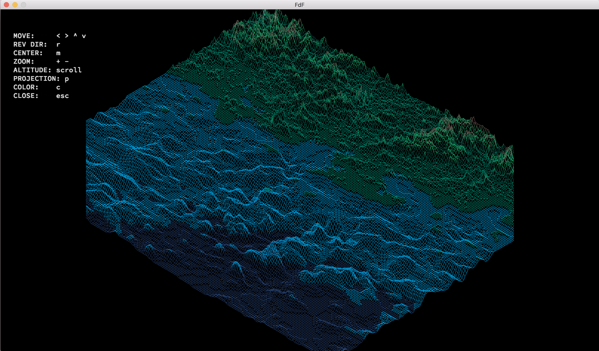

# FdF
Hive Helsinki school project. The first graphic programming project and also my first project in GitHub. This project is about creating a simplified 3D graphic representation of a relief landscape.

## Compiling and running ##
- This project is tested with macOS only
- Download [Minilibx](https://github.com/pbondoer/MinilibX) 
- Run `make`
- Once the program is compiled run it with `./fdf <map>`
- There are example maps at the maps directory.

## Controls and features ##
- Arrow keys move the map
- r reverses the arrow keys directions
- m resets the map to the middle
- \+ and - zoom
- mouse scroll changes altitude
- p changes projection
- c changes color theme
- esc closes the program

## Notes ##
Since this is a school project I had to follow some quidelines, for example:
- No global variables
- Functions max. 25 lines long
- Lines max. 81 characters long
- No initializing variables while declaring them
- Allowed library functions:
  * open, read, write, close, malloc, free, perror, strerror, exit
  * All the functions defined in the math library
  * All the functions defined in the miniLibX 

## Sources ##
- [Minilibx by pbondoer](https://github.com/pbondoer/MinilibX)
- [FdF maps by jgigault](https://github.com/jgigault/42MapGenerator)
